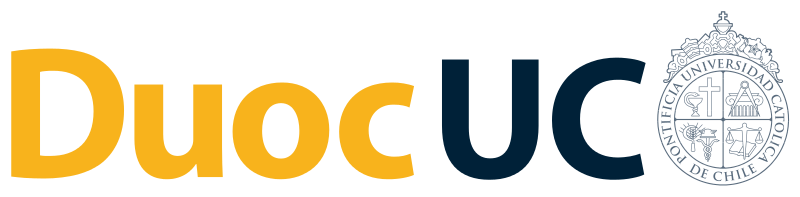

# TAY5111 - TECNOLOGÍAS DE ALMACENAMIENTO

  

# NOMBRE DE ACTIVIDAD

## ANTECEDENTES GENERALES

Archivos asociados a la actividad 3.3 y 3.4 (AWS Academy)

## REQUERIMIENTOS PARA ESTA ACTIVIDAD

Para el desarrollo de esta actividad se requiere AWS AcademY Lab Learner

## DESARROLLO DE ACTIVIDAD

Esta actividad consiste en ...

## CONTRIBUCIONES

Contribuciones son bienvenidas! Revisa nuestra [Guía de Contribuciones](./docs/contributors.md)

## CÓDIGO DE CONDUCTA

👋 Por favor, contribuye con amabilidad. Revisa nuestro [Código de Conducta](./docs/CODE_OF_CONDUCT.md)
